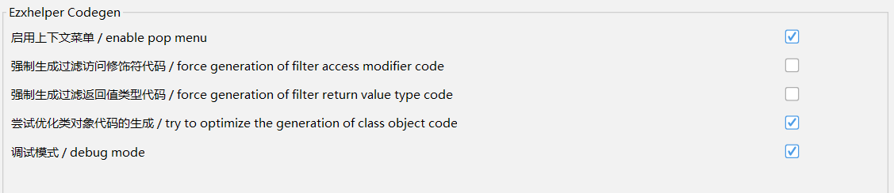

## JADX ezxcodegen plugin

一个用于在 jadx 中快速生成 EzXHelper hook 代码的插件，针对同名方法等进行了一些自动化额外检查以避免 hook 错误目标。

安装：依次点击： `插件` - `安装插件` - `选择插件 jar`，选择插件 jar 包路径进行安装

**目前暂时只支持 复制为 kotlin 代码**。




## 示例

反编译代码：

```java
public static synchronized void b(RequestType requestType, Object obj, String str, Object... objArr) {
    synchronized (CacheManager.class) {
        c(requestType, obj, null, str, objArr);
    }
}
```

在方法名上右键，可快速生成：

```kotlin
MethodFinder.fromClass("com.example.app.data.CacheManager")
    // public static synchronized b(Lcom/example/app/proto/mapping/RequestType;Ljava/lang/Object;Ljava/lang/String;[Ljava/lang/Object;)V
    .filterByName("b")
    .filterByParamTypes(
        ClassUtils.loadClass("com.example.app.proto.mapping.RequestType"),
        Object::class.java, String::class.java, Array::class.java
    ).first().createHook {
        before {

        }
    }
```

## 题外话

依稀记得 smali 会有与 java 方法重载的异常情况，所以内部写了一些筛选的函数。但是现在一查好像没有这种情况了...

未确定某些额外的检查是否是必需的，所以代码有点乱，但是能用。
